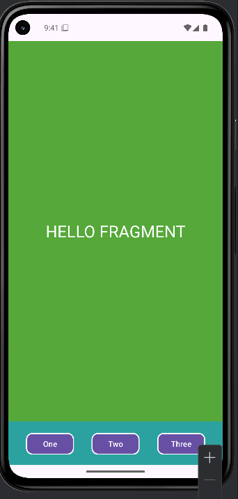
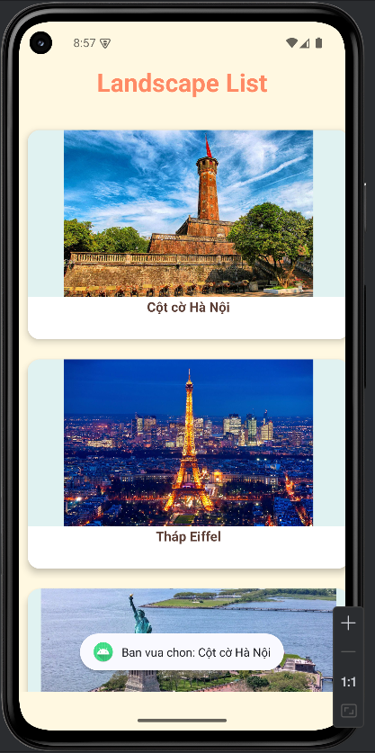
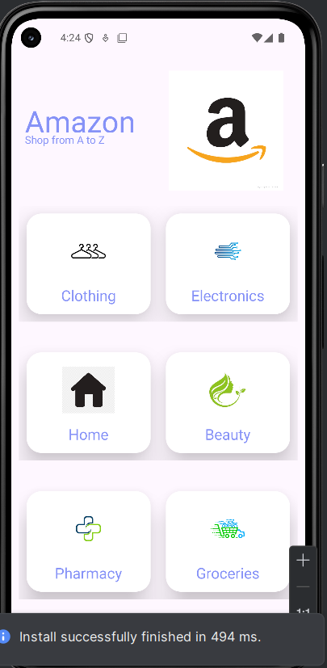
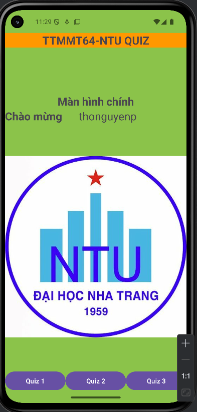
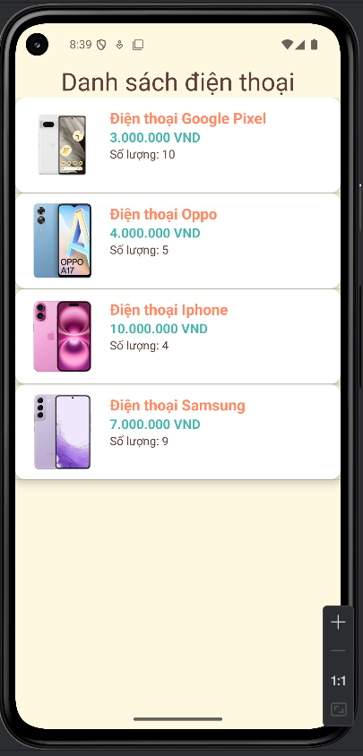
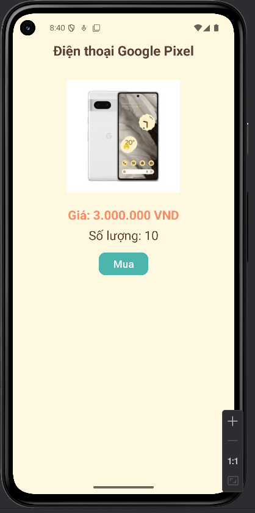
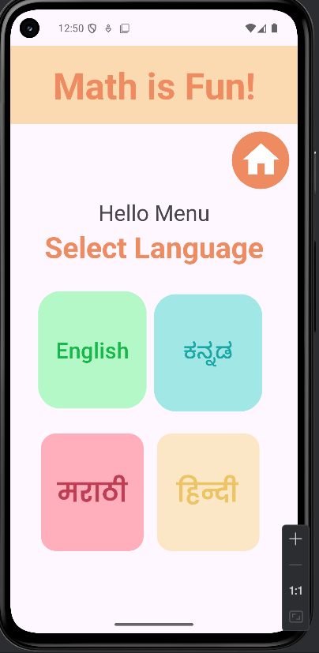
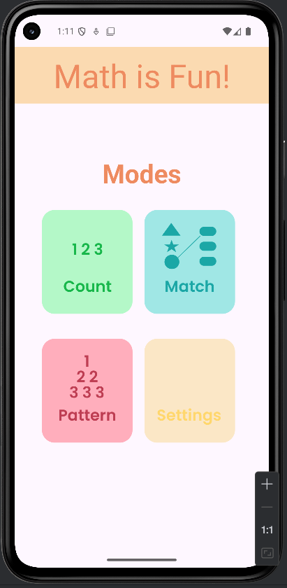

# 📌 64133133 - NGUYỄN PHƯỚC THỌ - Android Programming

## 📌 Giới thiệu
Đây là kho lưu trữ chứa các bài thực hành và bài tập bổ sung trong quá trình học lập trình Android. Mã nguồn được đẩy lên nhằm theo dõi tiến trình học

---
## Bộ màu thường sử dụng cho các bài sử dụng:
- 🔹 **Màu chính (Primary):** `#FF8A65` *(Cam pastel)*
- 🔹 **Màu phụ (Accent):** `#4DB6AC` *(Xanh mint)*
- 🔹 **Màu phụ tone nhẹ (Lighter Accent):** `#E0F2F1` *(Xanh mint nhẹ, thường để thay thế accent)*
- 🔹 **Màu nền (Background):** `#FFF8E1` *(Vàng kem)*
- 🔹 **Màu chữ (Text):** `#5D4037` *(Nâu đậm)*
---

## BÀI TẬP MỚI NHẤT (16/04/2025)
### 🔹 Ex11_THS_Fragment_Static
- 📂 [Xem mã nguồn](./Ex11_THS_Fragment_Static/app/src/main/)
- Hình ảnh minh họa:

  

---

## SOURCES CODE BÀI TẬP THỰC HÀNH
Dưới đây là danh sách các bài tập thực hành kèm theo hình ảnh minh họa:

### 🔹 Ex11_THS_Fragment_Static
- 📂 [Xem mã nguồn](./Ex11_THS_Fragment_Static/app/src/main/)
- Hình ảnh minh họa:

  

### 🔹 Ex10_RecyclerView
- Update: Thay đổi 1 chút về màu sắc trong layout, hoàn thành phần toast khi onclick
- 📂 [Xem mã nguồn](./Ex10_RecyclerView/app/src/main/)
- Hình ảnh minh họa:

  

### 🔹 Ex9_DashboardMaterial
- 📂 [Xem mã nguồn](./Ex9_DashboardMaterial/app/src/main/)
- Hình ảnh minh họa:

  
  

### 🔹 Ex8_LoginPage
- 📂 [Xem mã nguồn](./Ex8_LoginPage/app/src/main/)
- Hình ảnh minh họa:

  

### 🔹 Ex7_IntentLogin
- 📂 [Xem mã nguồn](./Ex7_IntentLogin/app/src/main/)
- Hình ảnh minh họa:

  
  
  

### 🔹 Ex_6_ListViewDemo
- 📂 [Xem mã nguồn](./Ex_6_ListViewDemo/app/src/main/)
- Hình ảnh minh họa:

  

### 🔹 Ex6_IntentDonGian
- 📂 [Xem mã nguồn](./Ex6_IntentDonGian/app/src/main/)
- Hình ảnh minh họa:

  

### 🔹 Ex4,5_AddSubMulDiv
- Update: Thống nhất 1 layout cho tất cả các bài cộng trừ nhân chia
- Sử dụng: CardView và Material Button
- 📂 [Xem mã nguồn Activity](./Ex5_AddSubMulDiv_Activity/app/src/main/)
- 📂 [Xem mã nguồn Onclick](./Ex4_AddSubMulDiv_Onclick/app/src/main/)
- 📂 [Xem mã nguồn Anonymous](./Ex5_AddSubMulDiv_Anynomous/app/src/main/)
- 📂 [Xem mã nguồn Var](./Ex5_AddSubMulDiv_Var/app/src/main/)

- Hình ảnh minh họa:

  

### 🔹 Ex3_AppCong
- 📂 [Xem mã nguồn](./Ex3_AppCong/app/src/main/)
- Hình ảnh minh họa:

  

### 🔹 Ex2_LinearLayout
- 📂 [Xem mã nguồn](./Ex2_LinearLayout/app/src/main/)
- Hình ảnh minh họa:

  

### 🔹 Ex1_ConstraintLayout
- 📂 [Xem mã nguồn](./Ex1_ConstraintLayout/app/src/main/)
- Hình ảnh minh họa:

  

### 🔹 HelloWorld
- 📂 [Xem mã nguồn](./HelloWorld/app/src/main/)
- Hình ảnh minh họa:

  

---

## CÁC BÀI TẬP LÀM THÊM
Dưới đây là danh sách các bài tập làm thêm kèm theo hình ảnh minh họa:
### 🔹 LT9_LVNangCao
- Tạo class riêng chứa dữ liệu và adapter riêng để truyền dữ liệu lên layout
- Dùng CardView bọc lấy item để có bo viền và bóng mờ
- Sử dụng lớp NumberFormat có sẵn để định dạng giá tiền (xxx.xxx.xxx VND)
- 📂 [Xem mã nguồn](./LT9_LVNangCao/app/src/main/)
- Hình ảnh minh họa:

  
  

### 🔹 LT8_FirstFigmaProject
- 📂 [Xem mã nguồn](./LT8_FirstFigmaProject/app/src/main/)
- Hình ảnh minh họa:

  
  

### 🔹 LT7_AppTracNghiemToan
- 📂 [Xem mã nguồn](./LT7_AppTracNghiemToan/app/src/main/)
- Hình ảnh minh họa:

  

### 🔹 LT6_FlappyBird
- 📂 [Xem mã nguồn](./LT6_flappybird/core/src/main/java/com/ltandroid/flappybird/)
- Hình ảnh minh họa:

  
  

### 🔹 LT5_LoginMaterialLayout
- 📂 [Xem mã nguồn](./LT5_LoginMaterialLayout/app/src/main/)
- Hình ảnh minh họa:

  
  
  
  

### 🔹 LT4_TestTracNghiem
- 📂 [Xem mã nguồn](./LT4_TestTracNghiem/app/src/main/)
- Hình ảnh minh họa:

  

### 🔹 LT3_TinhChuViDienTich
- 📂 [Xem mã nguồn](./LT3_TinhChuViDienTich/app/src/main/)
- Hình ảnh minh họa:

  
  
  

### 🔹 LT2_DoiNhietDo
- 📂 [Xem mã nguồn](./LT2_DoiNhietDo/app/src/main/)
- Hình ảnh minh họa:

  

### 🔹 LT1_BMIApp
- 📂 [Xem mã nguồn](./LT1_BMIApp/app/src/main/)
- Hình ảnh minh họa:

  